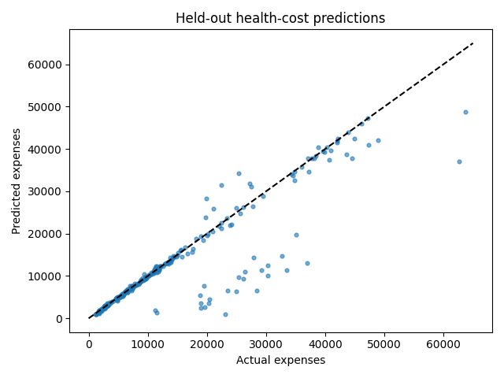

# Health-cost prediction with a dense neural network

A supervised regression project that predicts insurance expenses from six demographic and lifestyle features. It demonstrates tabular preprocessing, leakage-aware splitting, neural-network training, early stopping, and evaluation in the original expense units.

**Method:** a multilayer perceptron (dense neural network). The historical repository name contains “linear regression,” but the implemented model is nonlinear.

## Run locally

```bash
git clone https://github.com/fatemeh-akbarifar/fcc-linear-regression.git
cd fcc-linear-regression
python3 -m venv .venv
source .venv/bin/activate
python -m pip install -r requirements.txt
python PredictHealthCosts.py
```

Use Python **3.9–3.11**; the automated workflow targets Python 3.11. On Windows, activate with `.venv\Scripts\activate`. A first run requires internet access for dependencies and missing datasets. Subsequent runs reuse local data. CPU execution is supported; neural-network training is slower without an accelerator.

Use a Python 3.9–3.11 kernel for the notebook; hosted runtimes with newer Python versions are outside the pinned environment. The verified execution path is the local command line.

Notebook: [health_cost_regression.ipynb](health_cost_regression.ipynb). [Open in Colab](https://colab.research.google.com/github/fatemeh-akbarifar/fcc-linear-regression/blob/main/health_cost_regression.ipynb).

## Method

1. Use an 80/20 outer split with `random_state=0`; reserve 20% of the training pool for validation using seed 42.
2. Encode the original six features (`age`, `sex`, `bmi`, `children`, `smoker`, `region`) with fixed category mappings.
3. Fit a Keras normalization layer **only on training rows**, and include it in the saved model.
4. Train two 64-unit ReLU layers with RMSprop and MAE loss. Scale the output by 10,000 to improve optimization while retaining expense-unit predictions.
5. Restore the best validation-loss weights, then evaluate the held-out test set once. Report MAE and RMSE, and compare MAE with the challenge threshold of 3,500.

The modernization uses the simpler two-layer architecture from the later Colab version. It changes the original MSE training objective to MAE and adds early stopping. Ordinal region codes preserve the original approach but impose artificial ordering; one-hot encoding is a useful future comparison.

## Outputs

`artifacts/` contains `model.keras`, `metrics.json`, `history.json`, and `predictions.csv`. Generated artifacts and downloaded data are ignored by Git. The run also saves `predictions.png`.

## Verified results

Verified held-out **MAE: 2,198.32** (challenge target: below 3,500); **RMSE: 5,618.40** across 268 test rows.

See [the reproducibility report](docs/validation.md) for measured results, commands, environment, and the limits of validation.



## Tests

```bash
python -m pip install -r requirements-dev.txt
python -m pytest -q
```

The included GitHub Actions workflow runs focused tests, including saved-model round trips where applicable. It does not retrain the full dataset on every push.

## Limitations

This is an educational model on a small historical dataset. A single split does not establish robustness or fairness. Predictions may be negative because the output is unconstrained. It is not validated for clinical decisions, pricing, or individual insurance decisions.

## Project background and attribution

Developed by **Fatemeh Akbarifar** as part of freeCodeCamp's Machine Learning with Python projects. This repository packages and modernizes the original implementation with reusable Python entry points, dependency pins, tests, and reproducible evaluation. [Engineering notes](docs/engineering.md) distinguish original work from the reproducibility improvements.

- [freeCodeCamp project starter](https://github.com/freeCodeCamp/boilerplate-linear-regression-health-costs-calculator)
- [Dataset used by the project](https://cdn.freecodecamp.org/project-data/health-costs/insurance.csv)

The challenge design and supplied datasets are external resources; their original terms apply. No new dataset ownership or certification claim is made here.
